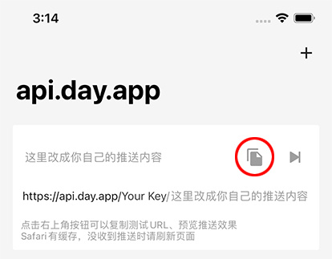
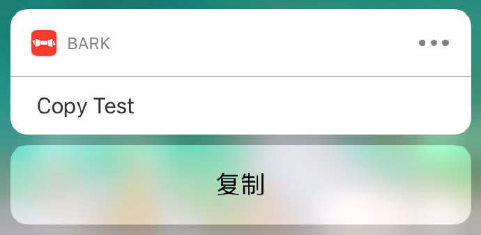

## 最终效果

- 通过特定的接口直接往iPhone上发送通知
- 支持链接转跳
- 支持一键复制
- 支持自定义图标
<!-- more -->


## 项目介绍

>传统通知方式例如邮件、聊天软件来做自动提醒还是略微麻烦。
>
>Bark提供http接口，简单调用即可给自己的iPhone发送推送。
>
>可以为你带来非常及时、稳定可靠、隐私安全的推送服务。
>
>
>
>Bark不会消耗设备的电量， 核心功能是基于系统推送服务与推送扩展，APP本体并不需要运行。
>
>
>
>Bark可以非常可靠的保证你的隐私安全。
>
>你可以手动或通过docker在自己的服务器上运行Bark服务端，或者自行实现服务端。
>
>数据将在 你的服务器-系统推送服务器-你的设备 之间传输，确保任何推送信息都不会被泄漏。
>
>APP 是通过 Github Action 编译上传，保证你使用的APP版本是由开源代码编译，未经任何人修改（验证方法请在 APP 内查看)。
>
>
>
>Bark保存在本地的通知消息历史也非常安全。
>
>通过 NotificationServiceExtension 扩展，在收到推送时将推送信息保存在本地，不会经过其他任何设备。
>
>历史记录仅由个人iCloud私有库进行同步，可以确保你产生的任何通知，将只留在你的设备与你的iCloud中


#### 相关链接

[项目主页](https://github.com/Finb/Bark)

[作者博客](https://day.app/)

[App Store](https://apps.apple.com/cn/app/bark-customed-notifications/id1403753865)


## 使用说明

### 内容推送

1. 打开APP，复制测试URL 



2. 修改内容，请求这个URL
```
可以发 get 或者 post 请求 ，请求成功会立即收到推送 

URL 组成: 第一个部分是 key , 之后有三个匹配 
/:key/:body 
/:key/:title/:body 
/:key/:category/:title/:body 

title 推送标题 比 body 字号粗一点 
body 推送内容 换行请使用换行符 '\n'
category 另外的功能占用的字段，还没开放 忽略就行 
post 请求 参数名也是上面这些
```

### 复制参数

收到推送时下拉推送（或在通知中心左滑查看推送）有一个`复制`按钮，点击即可复制推送内容。



```objc
//将复制“验证码是9527”
https://api.day.app/yourkey/验证码是9527
```

携带参数 automaticallyCopy=1， 收到推送时，推送内容会自动复制到粘贴板（如发现不能自动复制，可尝试重启一下手机）
```objc
//自动复制 “验证码是9527” 到粘贴板
https://api.day.app/yourkey/验证码是9527?automaticallyCopy=1 
```


携带copy参数， 则上面两种复制操作，将只复制copy参数的值
```objc
//自动复制 “9527” 到粘贴板
https://api.day.app/yourkey/验证码是9527?automaticallyCopy=1&copy=9527
```

#### 其他参数

* url
```
// 点击推送将跳转到url的地址（发送时，URL参数需要编码）
https://api.day.app/yourkey/百度网址?url=https://www.baidu.com 
```
* isArchive
```
// 指定是否需要保存推送信息到历史记录，1 为保存，其他值为不保存。
// 如果不指定这个参数，推送信息将按照APP内设置来决定是否保存。
https://api.day.app/yourkey/需要保存的推送?isArchive=1
```
* group
```
// 指定推送消息分组，可在历史记录中按分组查看推送。
https://api.day.app/yourkey/需要分组的推送?group=groupName
```
* icon (仅 iOS15 或以上支持）
```
// 指定推送消息图标
https://api.day.app/yourkey/需要自定义图标的推送?icon=http://day.app/assets/images/avatar.jpg
```
* 时效性通知
```
// 设置时效性通知
https://api.day.app/yourkey/时效性通知?level=timeSensitive

// 可选参数值
// active：不设置时的默认值，系统会立即亮屏显示通知。
// timeSensitive：时效性通知，可在专注状态下显示通知。
// passive：仅将通知添加到通知列表，不会亮屏提醒
```
