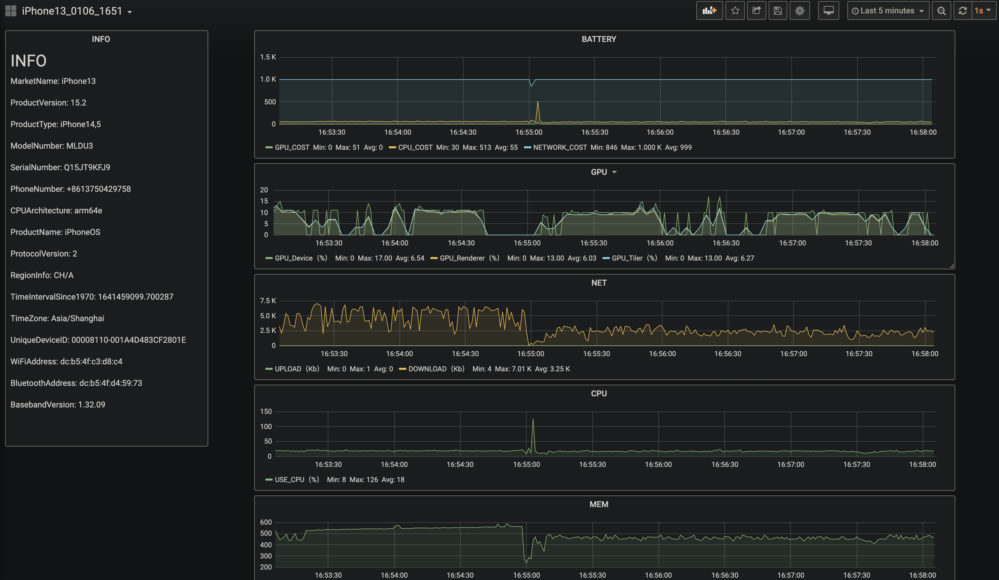

## 运行效果



## 项目介绍

项目地址：[yanbo92/iOS-perf](https://github.com/yanbo92/iOS-perf)

性能测试一直是APP测试的一个重要部分，而在 `Android`上由于系统的开放特性，相关工具支持比较多，比如 `solopi`等。但在 `iOS`上，腾讯家的 `perfdog`本来还是十分好用的，但收费了就有点难受，而直接用 `Xcode`的 `Instruments`又对Mac有刚需，很难支撑公司的测试需求。此时看到[这个贴子](http://testerhome.com/topics/31066)，上手跑了几次，还挺好用的，于是就顺着思路做了下去，有了这个比较完善的项目。

当前支持获取的性能数据包括GPU、CPU、内存、FPS、功耗、网络、温度，以及一系列手机硬件数据，并将根据需求继续新增。

本项目基于jlintxia开源的iOS测试方案修改而来，增加动态建表，动态增加grafana面板以及docker打包环境等特性。其中iOS性能数据来源于开源工具tidevice和py-ios-device。

注意：本项目依赖MySQL进行性能数据存储，Grafana进行数据动态展示，也就是说需要在本机或者可达的网络（比如公司局域网） 上搭建MySQL+Grafana服务，我提供了一份docker-compose.yml文件，可以使用docker快速搭建一套环境。

## 相关工具

### Grafana

[官网](https://grafana.com/)

> Grafana是一个跨平台、开源的数据可视化网络应用程序平台。用户配置连接的数据源之后，Grafana可以在网络浏览器里显示数据图表和警告。该软件的企业版本提供更多的扩展功能。扩展功能通过插件的形式提供，终端用户可以自定义自己的数据面板界面以及数据请求方式。

### MySQL

[官网](https://www.mysql.com/cn/)

> MySQL原本是一个开放源码的关系数据库管理系统，原开发者为瑞典的MySQL AB公司，该公司于2008年被昇阳微系统收购。2009年，甲骨文公司收购昇阳微系统公司，MySQL成为Oracle旗下产品。

### py-ios-device

[项目地址](https://github.com/YueChen-C/py-ios-device)

> win，mac 跨平台方案，通过 Instruments 私有协议获取 iOS 相关性能指标数据。
>
> 相关文章链接:https://testerhome.com/topics/27159

### tidevice

[项目地址](https://github.com/alibaba/taobao-iphone-device)

> tidevice 是阿里的内部的一个小组用来做 iOS 自动化用的工具，通过逆向iOS通信协议，使用纯Python实现。目前淘宝和其他部分事业部已经全面使用了该技术，进行iOS应用的性能采集，UI自动化。
>
> 注：这里的被测应用无需做任何修改，使用不再局限于Mac上。

## 使用步骤

### 准备工作

服务端搭建依赖docker以及docker-compose，安装指南：

> https://dockerdocs.cn/get-docker/
>
> https://dockerdocs.cn/get-started/08_using_compose/

运行测试依赖python3环境，安装指南：

> https://www.python.org/downloads/

#### 服务端搭建

命令行运行

```shell
docker -v && docker-compose -v
```

如果能正常输出版本，如下，则表示docker环境正常，可以继续

> Docker version 20.10.8, build 3967b7d
>
> docker-compose version 1.29.2, build 5becea4c

拉取镜像并启动服务：

```shell
docker-compose up -d  
```

**提示：初次打开 `Grafana`时，系统会提示你修改密码，为了方便建议不修改，即保持账号密码均为 `admin`，否则在python运行指令中将要进行对应的传参。**

#### 本地环境搭建

命令行执行

```shell
pip install -r requirements.txt
```

### 运行命令

命令行执行：

```shell
python run.py --udid=00008110-001A4D483CF2801E \
--bundleid=com.apple.Preferences \
--grafana_host=localhost \
--grafana_port=30000 \
--grafana_user=admin \
--grafana_password=admin \
--mysql_host=localhost \
--mysql_port=33306 \
--mysql_username=root \
--mysql_password=admin \
--mysql_db=iOSPerformance
```

#### 运行参数说明

##### 建议修改参数

```
--bundleid：待测APP的包名，通过`ideviceinstaller -l`获取，默认值为`com.apple.Preferences`
--udid iPhone：手机的唯一标识符，通过 `idevice_id -l` 获取，客户端只连接一台手机时不用写
```

##### Grafana可选参数

```
--grafana_host：Grafana的主机地址，只写ip，不用写Scheme，也就是`http://`或者`https//`，默认值localhost
--grafana_port：Grafana的端口号，默认值30000
--grafana_user：Grafana的用户名，默认值admin
--grafana_password：Grafana的密码，默认值admin
```

##### MySQL可选参数

```
--mysql_host：MySQL的主机地址，不用写Scheme，也就是`http://`或者`https//`，默认值localhost
--mysql_port：MySQL的端口号，默认值33306
--mysql_user：MySQL的用户名，默认值root
--mysql_password：MySQL的用户名，默认值admin
```

### 数据导出

命令行执行：

```shell
python mysql.py --runid=iphone6_1008_1532 \
--mysql_host=localhost \
--mysql_port=33306 \
--mysql_username=root \
--mysql_password=admin \
--mysql_db=iOSPerformance
```

其中，`--runid`为必须参数，可以从显示测试数据的Grafana页面的左上角找到，通常为手机名称+月日+时分。其余Mysql参数均为可选参数，默认值与上方[MySQL可选参数](#MySQL可选参数)相同。

## 心得

Docker起服务实在是太方便了，grafana做可视化也很香。也很感慨现在测试开发方面的开源环境发展起来了，有很多现成的代码可以参考。

## 参考文章

[PerfDog | 移动全平台性能测试分析专家](https://perfdog.qq.com/)

[硬货来啦！！使用纯 python 实现 Instruments 协议，跨平台 (win,mac,linux) 获取 iOS 性能数据 · TesterHome](https://testerhome.com/topics/27159)

[新工具开源！一款iOS自动化利器（附地址）](https://tech.taobao.org/news/lxhg5l)

[实时可视化 iOS 性能数据 tidevice+pyiosdevice+mysql+grafana · TesterHome](http://testerhome.com/topics/31066)
