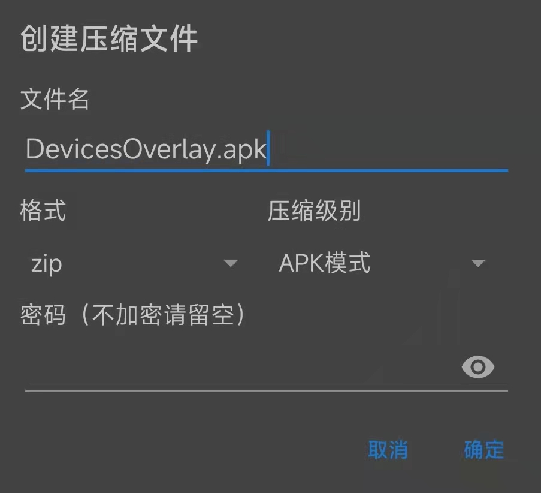

## 实装效果


## 模块介绍

如上图，鉴于前置摄像头附近的屏幕使用效率比较低，通常不显示什么内容，因此为了好看，我围绕这个摄像头做了一些图案，并做成了Magisk模块，这就是前置图案模块了。

模块是误打误撞玩出来的，起因是在[酷安](https://www.coolapk.com/)看到一个缩小前置摄像头黑圈的模块，让我感到很震撼，这里面居然有软件成分，能通过 `Magisk`模块改变  *（其实现在想想，硬件的边缘一定是粗糙的，只有矢量图才能做出无限平滑的圆，有软件成分还是十分理所当然的）。* 这个模块打开就是一个包含遮罩图资源的 `apk`，而缩小前置黑圈和本文的前置图案模块都是通过修改或者替换这些资源实现的，并无太多的编程成分，可以说只是修图打包的事情了。

## 制作步骤

### 我用到的工具

理论上都可以用同类的其他工具替代

- [MT管理器](https://mt2.cn/)
- [Picsart](https://picsart.com/)
- 遮罩图素材(通常我在[iconfont](https://www.iconfont.cn/)找)
- [Magisk模块模板](https://github.com/oasisfeng/magisk-module-template)

### 找到包含遮罩图的apk

用 `MT管理器`打开目录 `/system/product/overlay/`，开始一个一个 `apk `打开 `res `目录下带 `drawable `的文件夹，找以下四张图，如果有，那就是这个 `apk `了（注意也可能是 `.9.png`结尾的）。


目前我经手的机型全都在这个地方，我没有的手机就没办法找了，各位自求多福。

```shell
/system/product/overlay/DevicesOverlay.apk
```

### 解压apk

在 `MT管理器 `中长按这个 `apk`，触发以下菜单


先放到一个好操作的地方，比如sdcard根目录。

再次长按，解压成文件夹。

### 修图*4

这个步骤比较慢工出细活了，首先点击 `Picsart`下方中间的加号，打开解压出来文件夹中第一个步骤的图，四选一，哪张都行，打开后如下图


再找到下方菜单中的添加照片，选择一张需要遮罩上去的素材，比如星环图，然后操作旋转和位移按钮，直到星环的圆圈与原本的前摄重合（建议双指缩放提高操作精度），如下图


这个编辑界面可操作的内容就非常多了，比如调图案透明度，或者缩小前置就是把圈改小点或者整个干掉。

编辑完之后点击右上角的✅，再点一次⬇️按钮，保存这个图。


重复这个行为四次，对应最开始那张图的四个方向，每张图片都覆盖上你想要的遮罩图。

### 重命名，并替换文件夹里其他图片

`Picsart`默认会将图片保存在 `sdcard/pictures/picsart`目录，找到这些修改后的图，并命名成他们原本在安装包中的名字，也就是类似 `screen_round_corner_top.png`的名字。

再将这四张修改后的图片，复制回 `apk`解压文件夹中原本放置这些图片的位置，注意，如果文件夹中有多处都存在这四张图，那么全部都要替换掉，也就是这个复制替换的步骤，要重复多次。


### 重新打包apk，签名

所有遮罩图都替换完成后，回到 `apk`的根目录，也就是有这些目录的那个位置

```shell
META-INF
res
AndroidManifest.xml
resources.arsc
```

全选所有内容，选择压缩，文件名跟 `apk`原本的名字一样，比如 `DevicesOverlay.apk`，压缩级别选择 `apk模式`，如下图：



打包完成后，再长按 `apk`文件，选择签名，用默认配置直接按确认即可。

签名之后将原本未签名的 `apk`删掉，再将签名后的文件重命名回原本的名字，如 `DevicesOverlay.apk`即可。


### 制作模块

随便找个做好的同类模块解压了就能当模板用，修改解压后文件夹中的以下文件，改改机型、作者、模块名。

```shell
README.md
module.prop
install.sh
```

再将做好的 `apk`按照系统原本的路径放进去即可。

操作完成后，回到模块根目录，全选文件进行压缩，选择标准压缩，`.zip`格式。

压缩完成即可刷入试用了。


## 成品模块下载

[小米13](https://yanbo92.lanzoum.com/b00qms0uh)

[小米13 Pro](https://yanbo92.lanzoum.com/b00qmzfrg)

[小米12 Pro](https://yanbo92.lanzoum.com/b00qn1eaf)

[小米12S Pro](https://yanbo92.lanzoum.com/b00qn4y6j)

[小米12S Ultra](https://yanbo92.lanzoum.com/b00qmxehi)

[小米11 Pro](https://yanbo92.lanzoum.com/b00qmtcqb)

[红米K40](https://yanbo92.lanzoum.com/b00qmt6rg)

[红米K40S](https://yanbo92.lanzoum.com/b00qmzkmb)

[图案素材](https://yanbo92.lanzoum.com/icX0N0mb32ji)
