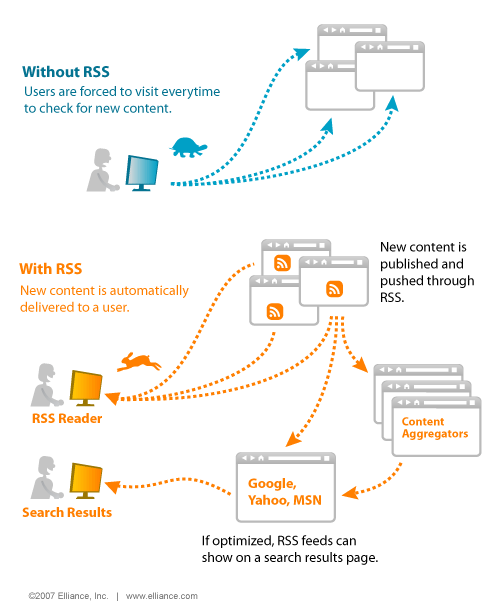

## 何为RSS

> RSS（简易信息聚合，也叫Really Simple Syndication、聚合RSS、聚合内容），是一种消息来源格式规范，用以聚合经常发布更新数据的网站，例如博客文章、新闻、音频或视频的网摘。RSS文件（或称做摘要、网络摘要、或频更新，提供到频道）包含了全文或是节录的文字，再加上发用者所订阅之网摘布数据和授权的元数据。通常在时效性比较强的内容上使用RSS订阅能更快速获取信息，网站提供RSS输出，有利于让用户获取网站内容的最新更新。网络用户可以在客户端借助于支持RSS的聚合工具软件（例如SharpReader、NewzCrawler、FeedDemon），在不打开网站内容页面的情况下阅读支持RSS输出的网站内容。

在信息碎片化严重的今天，内容平台连网页版都想砍掉，强制用户安装APP。拥有一套自己的RSS方案能让你更轻松的获得关注的信息，逃离推荐算法带来的信息茧房。

## 何为Miniflux

`Miniflux`是一个极简、快速、轻便且易于安装的`Feed`订阅器，有如下特性

- 支持自定义刷新和拉取时间，避免打开 RSS 时浏览过时（半小时、几个小时前）的信息
- 极简&纯粹，FreshRSS 、Tiny Tiny RSS 无论从界面还是功能，都太重了。
- 支持图片代理，即服务器缓存图片，默认情况下，客户端是从 RSS 源头拉取的图片，这个有特殊的场景。
- 支持 Fever API ，可以跨平台。
- 使用 WatchTower 实现 Miniflux docker 自动更新。
- Web 端支持快捷键。

## 搭建教程

- 前往[Heroku](https://www.heroku.com/)注册一个账号
- 访问[anyuzu99/heroku-miniflux at main](https://github.com/anyuzu99/heroku-miniflux/tree/main)
- 注意确认切换到了`main`分支，下拉到底，点击`heroku button`超链接
- 填入`APP_NAME`以及`ADMIN_PASSWORD`等等环境变量，点击`Deploy`
- 稍等几分钟，你的域名就可以访问啦
- 附一份Miniflux的[环境变量详解](https://miniflux.app/docs/configuration.html)

## 参考

[Miniflux - Minimalist and Opinionated Feed Reader](https://miniflux.app/)

[Cloud Application Platform | Heroku](https://www.heroku.com/)

[anyuzu99/heroku-miniflux: one click to deploy miniflux on heroku](https://github.com/anyuzu99/heroku-miniflux)

